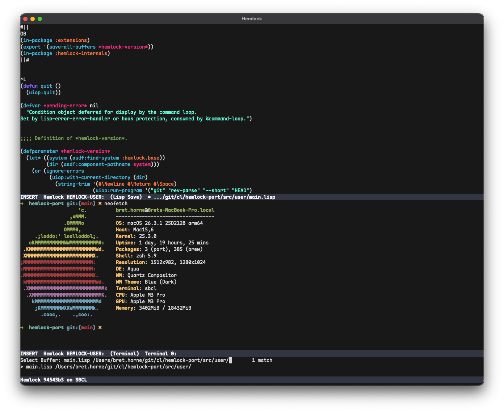

# Hemlock

Hemlock is a Common Lisp editor with a long history — born at CMU in the 1980s, it shipped inside CMUCL and later SBCL. This is an active modernization: dead backends removed, dependencies cleaned up, a tree-sitter integration for real syntax highlighting, and a Helix-style modal editing layer being built on top of the original architecture. The core is still the same with some tweaks and changes here and there...

**Status:** v0.2.0 - loads only with SBCL (2.5.9), TTY backend fully working (should at least on mac), modal editing in place. Webui backend in progress. 

---

### What's in here

- **TTY backend**   — terminal rendering, full color support (truecolor, 256, 16)
- **Tree-sitter**   - WIP
- **Terminal**      - full vt100/xterm capabilties
- **Modal editing** — Normal/Select modes, Mostly Helix keymap, spanning selections, TS textobjects, with inspiration in other places
- **Completions**   — interactive completion in the minibuffer

---

### Building

```
(asdf:load-system :hemlock)
```

Dependencies managed with [ocicl](https://github.com/ocicl/ocicl).

---


